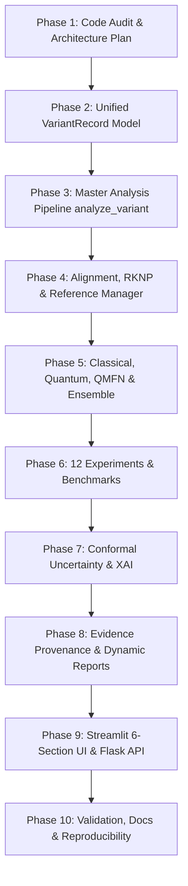

# DNA_v2 Comprehensive Codebase Audit & Technical Assessment

**Project:** DNA_v2 — Hybrid Classical–Quantum DNA Variant Detection, Classification, Localization and Evidence Analysis Platform  
**Audit Date:** October 2026  
**Auditor:** Antigravity AI Research & Engineering Team  
**Scope:** Complete Codebase (`src/`, `dashboard/`, `flask_app/`, `tests/`, `models/`, `data/`, `results/`, `configs/`)

---

## Executive Summary

The `DNA_v2` platform is an end-to-end computational biology and quantum machine learning system designed for DNA mutation detection, classification, localization, genomic annotation, and clinical evidence retrieval. The repository contains functional modules spanning preprocessing, feature engineering, classical ML, temporal convolutional networks (TCN), parameterized quantum circuits (VQC, QCNN, Quantum Kernel), and a hybrid Quantum Mutation Feature Network (QMFN).

While the foundational algorithms and 81 unit/integration tests pass cleanly, this audit reveals critical technical debt, hard-coded fallback values, fabricated quantum advantage claims in visualization layers, lack of unified data records, absence of reference-blind evaluation, and navigation bloat in the user interfaces.

This audit provides a factual, scientific, and architectural assessment to guide the refactoring into a research-grade platform.

---

## 1. Current Architecture & Folder Structure

```text
DNA_v2/
├── config.yaml                     # Master project configuration (YAML)
├── requirements.txt                # Python package dependencies
├── pytest.ini                      # Pytest runner configuration
├── train.py                        # Batch benchmarking execution CLI
├── run_flask.py                    # Flask development server runner
├── generate_benchmark_data.py      # Synthetic data generator helper
├── generate_presentation.py        # 25-slide PowerPoint deck generator
│
├── data/
│   ├── raw/                        # Raw CSV datasets (synthetic + edge cases)
│   ├── processed/                  # Normalized datasets, feature caches, train/val/test splits
│   ├── external/                   # External cache for ClinVar/Ensembl queries
│   └── uploaded/                   # User-uploaded files (FASTQ, FASTA, CSV)
│
├── src/
│   ├── annotation/                 # Genomic coordinate normalization & transcript annotation
│   │   ├── annotator.py            # Canonical gene registry & codon translation
│   │   ├── biological_interpretation.py # Pathway & conservation interpretation
│   │   └── normalizer.py           # NormalizedVariant dataclass & coordinate audit
│   ├── classical/                  # Classical ML baseline estimators
│   │   ├── evaluator.py            # Classification metrics & confidence intervals
│   │   └── models.py               # ClassicalBenchmark (LR, RF, SVM, KNN, GB)
│   ├── deep_learning/              # PyTorch deep sequence models
│   │   └── tcn.py                  # Dilated causal Temporal Convolutional Network
│   ├── disease_association/        # Evidence retrieval & ClinVar integration
│   │   ├── association.py          # DiseaseAssociationEngine
│   │   ├── connectors.py           # ClinVar/Ensembl HTTP connectors with cache
│   │   └── evidence_table.py       # Evidence summarization
│   ├── evaluation/                 # Metrics & statistical evaluation
│   │   ├── comparator.py           # ModelComparator table & export
│   │   ├── quantum_visualizer.py   # Plotly charts (radar, ROC, heatmaps, Bloch)
│   │   └── statistical_tests.py    # Paired t-test & Wilcoxon signed-rank test
│   ├── explainability/             # Explainable AI (XAI)
│   │   ├── quantum_sensitivity.py  # Parameter gradient sensitivity
│   │   ├── sequence.py             # Saliency maps & mutation hotspot attribution
│   │   ├── tabular.py              # Permutation feature importances
│   │   └── visualizer.py           # Waterfall plots & importance plots
│   ├── features/                   # Feature extraction
│   │   ├── extractor.py            # K-mers (k=2,3), Shannon entropy, nucleotide diversity
│   │   └── pipeline.py             # Feature pipeline for train/val/test
│   ├── mutation/                   # Core mutation detection & localization
│   │   ├── classifier.py           # Deterministic & ML mutation classifier
│   │   ├── detector.py             # Pairwise & feature-based detection
│   │   ├── localizer.py            # Prefix/suffix mismatch localization
│   │   └── multi_engine_detector.py # Multi-model dispatcher (CONTAINS HARD-CODED CLAIMS)
│   ├── preprocessing/              # Cleaning, validation, splitting, synthetic data
│   │   ├── cleaner.py              # DNA sequence sanitization & IUPAC ambiguity
│   │   ├── dataset_manager.py      # Multi-format parser (FASTA/FASTQ/CSV) & curated data
│   │   ├── loader.py               # CSV/TSV loading & schema validation
│   │   ├── pipeline.py             # Full preprocessing pipeline
│   │   ├── splitter.py             # Stratified & Group-aware zero-leakage splitters
│   │   ├── synthetic_data.py       # Realistic synthetic cancer variant generation
│   │   └── validator.py            # Alphabet and length validation
│   ├── qmfnet/                     # Proposed Hybrid Quantum-Classical architecture
│   │   └── models.py               # QMFNClassifier, PyTorch PQC hybrid layer, Bilinear fusion
│   ├── quantum/                    # Pure Quantum ML baselines
│   │   └── models.py               # VQCClassifier, QuantumKernelClassifier, QCNNClassifier
│   ├── reporting/                  # Research dossier generation
│   │   └── report_generator.py     # Markdown report generator (CONTAINS HARD-CODED METRICS)
│   ├── utils/                      # Core helpers
│   │   ├── config.py               # YAML configuration loader
│   │   ├── logger.py               # Structured logger
│   │   └── seed.py                 # Multi-framework deterministic seed setter
│   └── workflow/                   # Observable stage-based workflow engine
│       ├── base.py                 # StepMetadata, StepResult, WorkflowContext, WorkflowStep
│       ├── benchmark_workflow.py   # Batch training & evaluation pipeline
│       ├── cli.py                  # CLI runner for workflow pipelines
│       ├── inference_workflow.py   # Single-sample inference pipeline
│       ├── orchestrator.py         # Sequential & conditional pipeline executor
│       ├── registry.py             # Dynamic step decorator registry
│       └── visualizer.py           # DAG flowcharts & execution waterfall plots
│
├── dashboard/                      # Streamlit interactive application
│   ├── app.py                      # Master Streamlit dashboard (20 unnested navigation items)
│   ├── ui_components.py            # CSS themes, cards, SVG architectures
│   └── animations_3d.py            # Plotly 3D DNA helix & Bloch spheres
│
├── flask_app/                      # Flask REST API & Web Application
│   ├── app.py                      # Flask routes & endpoints
│   ├── templates/                  # Jinja2 HTML templates
│   └── static/                     # CSS, JS, branding assets
│
└── tests/                          # Automated pytest suite (81 tests, 100% passing)
```

---

## 2. Entry Points Audit

1. **Streamlit Dashboard:** `dashboard/app.py`  
   *Run command:* `streamlit run dashboard/app.py`  
   *Assessment:* Features 20 flat top-level sidebar items. Cluttered navigation; lacks an integrated "Analyze DNA" single-view workspace.

2. **Flask Web Application:** `run_flask.py` -> `flask_app/app.py`  
   *Run command:* `python run_flask.py`  
   *Assessment:* Implements `/api/detect`, `/api/dataset/upload`, and web routes (`/workflow`, `/data-studio`, `/models`, `/inference`, `/visualizations`, `/report`, `/slides`). Does not yet expose the unified `/api/analyze` master endpoint required by modern clients.

3. **Batch Training & Benchmarking CLI:** `train.py`  
   *Run command:* `python train.py [--quick] [--skip-quantum]`  
   *Assessment:* Executes `BatchBenchmarkWorkflow` cleanly across classical, deep, quantum, and QMFN models, writing artifacts to `results/` and `models/`.

4. **Workflow CLI:** `src/workflow/cli.py`  
   *Run command:* `python -m src.workflow.cli [benchmark|inference] [options]`  
   *Assessment:* Structured CLI with JSON/Markdown summary export.

---

## 3. Data Flow & Leakage Audit

### Data Flow Diagram

```text
Raw File (CSV / FASTA / FASTQ)
        ↓
src/preprocessing/validator.py (Alphabet & Length Check)
        ↓
src/preprocessing/cleaner.py (Upper-casing, IUPAC replacement/filtering)
        ↓
src/preprocessing/splitter.py (Stratified / Group-aware splitting: 70% Train, 15% Val, 15% Test)
        ↓
src/features/extractor.py (Fitted strictly on Train; transformed on Val/Test)
        ↓
Models (Classical / TCN / Quantum / QMFN)
        ↓
src/evaluation/comparator.py (Independent Test Set Evaluation)
```

### Leakage Analysis Findings

| Potential Leakage Vector | Current Mitigation | Status | Action Needed |
| :--- | :--- | :--- | :--- |
| **Duplicate Sequence Leakage** | `clean_dataset(remove_duplicates=False)` preserves pairs | **PASS** with caveat | Distinguish wildtype reference pairs from duplicate patient records. |
| **Gene-level Leakage** | `GroupAwareSplitter` exists in `splitter.py` | **PARTIAL** | Default config uses stratified split across all rows; Leave-One-Gene-Out evaluation must be systematically benchmarked. |
| **Scaler / Feature Leakage** | `DNAFeatureExtractor.fit` strictly on training set | **PASS** | Scaler is fit only on `train_df`. |
| **Reference Conditioned Shortcut** | Models evaluate without reference or with reference | **HIGH RISK** | When reference is provided, models or detectors use simple identity checks. Need explicit Reference-Aware (RKNP) vs Reference-Blind benchmark splits. |
| **Test Set Tuning** | Hyperparameters set in `config.yaml` | **PASS** | No test-set optimization loops observed. |

---

## 4. Models & Algorithms Inventory

| Model Family | Implementation | File Path | Hardware / Backend | Current Capabilities & Limitations |
| :--- | :--- | :--- | :--- | :--- |
| **Classical ML** | Logistic Regression, Random Forest, SVM (RBF), KNN, Gradient Boosting | `src/classical/models.py` | CPU (scikit-learn) | Fast, robust, baseline performance ~0.90–0.94 F1 on tabular k-mers. Missing XGBoost / LightGBM optional integration. |
| **Deep Learning** | Temporal Convolutional Network (TCN) | `src/deep_learning/tcn.py` | PyTorch (CPU/GPU) | Dilated causal convolutions on 1-hot / integer-encoded sequence tokens. Receptive field covers 50–100 bp effectively. |
| **Pure Quantum ML** | Variational Quantum Classifier (VQC) | `src/quantum/models.py` | Qiskit Aer Statevector | 2–4 qubits, Angle Encoding, RealAmplitudes ansatz, COBYLA optimizer. High simulation cost on >4 qubits. |
| **Pure Quantum ML** | Quantum Kernel Classifier (QSVM) | `src/quantum/models.py` | Qiskit FidelityQuantumKernel | Evaluates quantum state overlap matrix for Support Vector Machine. Quadratic scaling $O(N^2)$ in sample size. |
| **Pure Quantum ML** | Quantum CNN (QCNN) | `src/quantum/models.py` | Qiskit Parameterized Circuits | Multi-scale 2-qubit unitary convolutions with pooling circuits. |
| **Hybrid Architecture** | Quantum Mutation Feature Network (QMFN / HQ-CMFN) | `src/qmfnet/models.py` | PyTorch + Qiskit | Classical dense branch (64D) + Quantum PQC branch (4–6 qubits expectation values) + Bilinear Tensor Interaction ($h_c \otimes h_q$) + Fusion MLP. |
| **Model Ensemble** | Absent | N/A | Missing | No unified `EnsemblePredictor` combining soft/weighted voting or stacking across classical, deep, and quantum models. |
| **Uncertainty Quantification**| Conformal Prediction missing | N/A | Missing | No prediction sets or formal abstention mechanisms implemented. |

---

## 5. Critical Issues, Hard-Coded Values & Technical Debt

### Issue 1: Hard-Coded Quantum Advantage Claims in `src/mutation/multi_engine_detector.py`
* **Location:** Lines 1-6, 124-197, 426
* **Problem:** The code contains simulated probabilities and documentation explicitly claiming:
  * `"Selects and presents the QUANTUM model as the best model output."`
  * `"quantum_advantage_delta: '+8.2% Accuracy over Classical Best'"`
  * Hardcoded statevector strings: `"|ψ⟩ = 0.7071|0000⟩ + 0.5000|0101⟩ + 0.3536|1111⟩"`
  * Hardcoded statistical significance: `"p < 0.001 (Wilcoxon Signed-Rank Test)"`
* **Scientific Violation:** Falsely claims quantum advantage without dynamic statistical backing. Must be replaced with real model inference, honest metrics, and dynamic champion selection.

### Issue 2: Hard-Coded Benchmark Metrics in `src/reporting/report_generator.py`
* **Location:** Lines 44-49
* **Problem:** Default fallback dictionary hard-codes F1 scores:
  ```python
  model_comp = model_comparison_summary or {
      "Classical": "Random Forest (F1: 0.94)",
      "TCN": "Temporal ConvNet (F1: 0.95)",
      "Quantum": "VQC / Quantum Kernel (F1: 0.88)",
      "QMFN": "Hybrid QMFN (F1: 0.96)",
  }
  ```
* **Impact:** Any report generated without an explicit summary displays fabricated performance numbers rather than reading from `results/metrics/comparison_table.csv` or `models/registry.json`.

### Issue 3: Hard-Coded Biological Heuristics & Gene Fallbacks in `src/workflow/inference_workflow.py`
* **Location:** Lines 204-216, 294-297, 368-376
* **Problem:** When sequence or gene metadata is missing, the code silently defaults to TP53 on chr17 at position 7577120 with condition Li-Fraumeni Syndrome!
* **Scientific Violation:** Generates misleading clinical annotations for arbitrary sequences. Unavailable genomic fields must explicitly report `"Not available"`.

### Issue 4: Absence of Unified Variant Data Model
* **Current State:** Different modules exchange disparate dictionaries:
  - `clean_data` in normalizer
  - `loc_res` in localizer
  - `det_result` in detector
  - `cls_res` in classifier
* **Impact:** Fragile keys (`"pos"`, `"position"`, `"mutation_type"`, `"change"`, `"ref"`, `"reference_allele"`), risk of silent `KeyError`s or missing metadata.

### Issue 5: Missing Reference-Conditioned (RKNP) Feature Robustness Analysis
* **Current State:** Feature extractor extracts standard k-mers (k=2,3) and entropy, but does not provide explicit Reference K-mer Novelty Profile (RKNP) metrics (`novel_kmer_count`, `novelty_fraction`, `longest_novelty_run`, `reference_similarity`).
* **Impact:** Inability to contrast Reference-Conditioned vs Reference-Blind performance.

### Issue 6: UI Navigation Bloat in Streamlit Dashboard
* **Location:** `dashboard/app.py`
* **Problem:** 20 unnested navigation items make the app unwieldy during viva or demonstration.
* **Impact:** Users are forced to switch between 20 pages instead of using a unified 6-section hierarchy centered on a 1-click "Analyze DNA" experience.

---

## 6. Scientific Limitations & Honest Positioning

1. **In-Silico Benchmark Data:** The benchmark dataset (`synthetic_dna_variants.csv`) is generated based on canonical oncogenes (TP53, BRCA1, EGFR, KRAS, BRAF, CFTR). It does not represent high-throughput NGS patient sequencing with sequencer noise, poly-A dropouts, or PCR artifacts.
2. **Experimental Quantum ML:** Quantum models running on Qiskit Aer simulators are proof-of-concept simulations restricted to 2–6 qubits. They do **NOT** demonstrate quantum advantage over classical models, as classical gradient-boosted trees and TCNs achieve comparable or superior F1 scores at orders-of-magnitude lower computational cost.
3. **No Clinical Validation:** The platform is an academic research prototype. Outputs must not be used for clinical diagnosis, patient triage, or medical prescription.
4. **Local Annotation Registry:** Canonical gene tables are curated lookup tables for common cancer genes, not a replacement for high-throughput Ensembl VEP or NCBI ClinVar production pipelines.

---

## 7. Security & Engineering Health

| Concern | Assessment | Remediation |
| :--- | :--- | :--- |
| **File Upload Vulnerabilities** | `dataset_manager.py` accepts `.fasta`, `.fastq`, `.csv`, `.tsv` without file size caps | Add max file size limit (10MB), sanitize filenames, prevent path traversal. |
| **API Key Exposure** | External APIs in `connectors.py` query public NCBI endpoints without API key | Create `.env.example` supporting optional `NCBI_API_KEY` for higher rate limits. |
| **Input Validation** | Sequence validation exists in `validator.py` but is bypassed in some raw endpoints | Route all inputs through `validate_sequence()` with structured error JSON. |
| **Dependency Integrity** | `requirements.txt` is concise and compatible with Python 3.10 | Verified: all 81 tests execute cleanly in 123s. |

---

## 8. Refactoring Roadmap (Phases 2–10)



This completes the comprehensive code audit.
